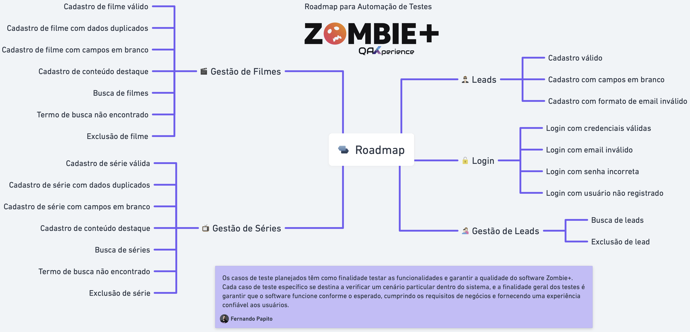
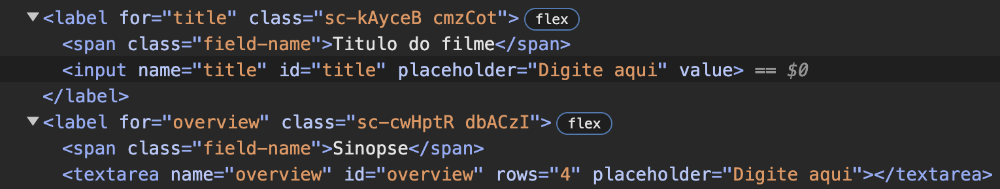

# QAx-Playwright-Zombie
Repositório para o curso de playwright da QAx





# Zombie+ (Regression Tests)

Os casos de teste planejados têm como finalidade testar as funcionalidades e garantir a qualidade do software Zombie+. Cada caso de teste específico se destina a verificar um cenário particular dentro do sistema, e a finalidade geral dos testes é garantir que o software funcione conforme o esperado, cumprindo os requisitos de negócios e fornecendo uma experiência confiável aos usuários.

## Landing Page

Os testes nesse conjunto verificam a funcionalidade de cadastro e autenticação de leads na fila de espera, garantindo que os leads possam se cadastrar com sucesso e que a autenticação funcione corretamente.

### Fila de espera (Leads)

- Cadastro válido
    - Ação: Preencher todos os campos obrigatórios (nome e email) com informações válidas e clicar em "Cadastrar".
    - Resultado esperado: O lead é cadastrado com sucesso no sistema.
- Cadastro com campos em branco
    - Ação: Deixar os campos de nome e/ou email em branco e clicar em "Cadastrar".
    - Resultado esperado: Uma mensagem de erro deve ser exibida, informando que os campos obrigatórios devem ser preenchidos.
- Cadastro com formato de email inválido
    - Ação: Preencher o campo de email com um formato inválido e preencher o campo de nome corretamente, depois clicar em "Cadastrar".
    - Resultado esperado: Uma mensagem de erro é exibida, informando que o formato do email é inválido.


____________________________________________________________________________________________________________________________________________
### Aula - Elementos Flutuantes.

Dica interessante do Papito:

Ao tentar mapear o elemento modal/toast que tem um tempo de exibição muito curto, o professor passou um pequeno truque que consiste em encontrar o texto que o elemento apresenta e clicar no elemento para então pegar o código html da página (que como clicamos no toast, o código html vai ser o do toast) no momento exato do click. Para pegar o texto ele usou a --ui do playwright: `npx playwright test --ui`, assim é possível ver o texto e criar um seletor: `await page.getByText("seus dados conosco").click()`.
Após clicar, agora pegamos o conteudo da página (toast) com o método: .content: `const content = await page.content()`. Agora com o html nós printamos no console: `console.log(content)`

Copiar todo o texto impresso no console

Agora na raiz do projeto, criar um arquivo chamado: `modal.html` e colar todo o conteudo copiado do console.

Dessa forma agora é possível observar com calma todo o html para criar um seletor robusto, que nesse caso será a classe `.toast`. Agora vamos validar se no elemento da classe `.toast` contem o texto: `Agradecemos por compartilhar seus dados conosco. Em breve, nossa equipe entrará em contato!`.
____________________________________________________________________________________________________________________________________________
### Aula - Elementos de Página Solta.

Eu criei um shell script para poder definir o número de workers que seriam executadas na executação dos testes @regression: `run_regression.sh`

É preciso dar permissão de execução para o novo arquivo criado, para isso faça o comando:
`chmod +x run_regression.sh`

Esse script basicamente verifica se existe uma variavel definida chamada `WORKERS` no comando do console: se não existir ele faz o comando para executar os testes regressivos normalmente:
- npx playwright test --grep @regression

Se a variável existir, então ele executa com a variável e o numero de workers definidos:
- npx playwright test --grep @regression --workers=$WORKERS

Para que isso funcionasse eu tive que mudar também o script do regressivo no arquivo `package.json`:
```
"scripts": {
    "temp": "npx playwright test --grep @temp",
    "regression": "./run_regression.sh"
}
```
____________________________________________________________________________________________________________________________________________
### Autenticação (Login)

- Login com credenciais válidas
    - Ação: Informar um email e senha válidos de um usuário registrado e clicar em "Login".
    - Resultado esperado: O usuário é redirecionado para a área logada do sistema.
- Login com email inválido
    - Ação: Informar um email inválido e uma senha válida e clicar em "Login".
    - Resultado esperado: Uma mensagem de erro deve ser exibida, informando que o email é inválido.
- Login com senha incorreta
    - Ação: Informar um email válido e uma senha incorreta e clicar em "Login".
    - Resultado esperado: Uma mensagem de erro deve ser exibida, informando que a senha está incorreta.
- Login com usuário não registrado
    - Ação: Informar um email não registrado e uma senha e clicar em "Login".
    - Resultado esperado: Uma mensagem de erro deve ser exibida, informando que o usuário não está registrado no sistema.

____________________________________________________________________________________________________________________________________________
### Aula - PageObjects by the book.

Como o Papito está usando um elemento da página Movies para fazer a validação do login, ele resolveu remover a função que verifica se está logado da LoginPage e o colocou em uma nova page chamada MoviesPage.
Eu, por outro lado, estou usando a própria página de login para fazer a validação de login e por isso a criação dessa página ainda não é necessária. Ao validar que o botão de login não está mais visível é igualmente possível verificar se o login ocorreu.
____________________________________________________________________________________________________________________________________________

# Admin

Esses testes visam validar as operações de cadastro, busca e exclusão de filmes e séries na administração do sistema. Eles garantem que os dados sejam armazenados corretamente, que as buscas retornem resultados precisos e que a exclusão de conteúdo seja realizada sem problemas.

## Gestão de Filmes

### Cadastro

- Cadastro de filme válido
    - Ação: Preencher todos os campos obrigatórios do formulário de cadastro de filme com informações válidas e clicar em "Cadastrar".
    - Resultado esperado: O filme é cadastrado com sucesso no sistema.
- Cadastro de filme com campos em branco
    - Ação: Deixar pelo menos um campo obrigatório em branco e clicar em "Cadastrar".
    - Resultado esperado: Uma mensagem de erro deve ser exibida, informando que os campos obrigatórios devem ser preenchidos.
- Cadastro de série com dados duplicados
    - Ação: Preencher o formulário com informações de uma série já cadastrada e clicar em "Cadastrar".
    - Resultado esperado: Uma mensagem de erro deve ser exibida, informando que a série já está cadastrada no sistema.
- Cadastro de conteúdo destaque
    - Ação: Preencher todos os campos obrigatórios e marcar o filme como destaque.
    - Resultado esperado: O filme marcado como destaque é exibida na landing page.

____________________________________________________________________________________________________________________________________________
### Aula - Interagindo com GetByLabel.

Nessa aula o Papito deu uma dica interessante sobre como o playwright é capaz de encontrar o elemento de input apenas usando o GetByLabel. Mas isso só acontece se o `for` do `label` tiver o mesmo `id`



Como é possível observar na imagem o `label for="title"` é igual ao `id="title"` e somente por isso é possível usar o label e encontrar o campo de input apenas usando o GetByLabel

```
<label for="title" class="sc-kAyceB cmzCot">
    <span class="field-name">Titulo do filme</span>
    <input name="title" id="title" placeholder="Digite aqui" value="">
</label>
```
____________________________________________________________________________________________________________________________________________


### Busca

- Busca de filmes
    - Ação: Realizar uma busca por título de filme existente.
    - Resultado esperado: A lista de filmes correspondentes ao critério de busca é exibida.
- Termo de busca não encontrado
    - Ação: Realizar a busca por título de filme que não existe.
    - Resultado esperado: Uma mensagem de erro deve ser exibida, informando que a busca não retornou dados conforme o termo de busca.

### Exclusão

- Exclusão de filme
    - Ação: Selecionar um filme da lista e clicar em "Excluir".
    - Resultado esperado: O filme é removido com sucesso do sistema.

## Gestão de Séries

### Cadastro

- Cadastro de série válida
    - Ação: Preencher todos os campos obrigatórios do formulário de cadastro de série com informações válidas e clicar em "Cadastrar".
    - Resultado esperado: A série é cadastrada com sucesso no sistema.
- Cadastro de série com dados duplicados
    - Ação: Preencher o formulário com informações de uma série já cadastrada e clicar em "Cadastrar".
    - Resultado esperado: Uma mensagem de erro deve ser exibida, informando que a série já está cadastrada no sistema.
- Cadastro de série com campos em branco
    - Ação: Deixar pelo menos um campo obrigatório em branco e clicar em "Cadastrar".
    - Resultado esperado: Uma mensagem de erro deve ser exibida, informando que os campos obrigatórios devem ser preenchidos.
- Cadastro de conteúdo destaque
    - Ação: Preencher todos os campos obrigatórios e marcar a série como destaque.
    - Resultado esperado: A série marcada como destaque é exibida na landing page.

### Busca

- Busca de séries
    - Ação: Realizar uma busca por título de série existente.
    - Resultado esperado: A lista de séries correspondentes ao critério de busca é exibida.
- Termo de busca não encontrado
    - Ação: Realizar a busca por título de série que não existe.
    - Resultado esperado: Uma mensagem de erro deve ser exibida, informando que a busca não retornou dados conforme o termo de busca.

### Exclusão

- Exclusão de série
    - Ação: Selecionar uma série da lista e clicar em "Excluir".
    - Resultado esperado: A série é removida com sucesso do sistema.

## Gestão Leads

Esses testes se concentram na funcionalidade de gerenciamento de leads, incluindo listagem, busca e exclusão de leads no sistema. Eles asseguram que os dados dos leads sejam exibidos corretamente, que a busca funcione e que os leads possam ser removidos conforme necessário.

- Busca de leads
    - Ação: Realizar uma busca por nome de lead existente.
    - Resultado esperado: A lista de leads correspondentes ao critério de busca é exibida.
- Exclusão de lead
    - Ação: Selecionar um lead da lista e clicar em "Excluir".
    - Resultado esperado: O lead é removido com sucesso do sistema.
